# 🧠 SafeSpace (Medi-Bot)
### AI-Powered Mental Health Assistant & Crisis Intervention System


**SafeSpace** is an advanced AI mental health companion designed to provide immediate, empathetic support and real-world crisis intervention. Unlike standard chatbots, SafeSpace combines the therapeutic depth of **MedGemma** (a fine-tuned medical LLM) with the reasoning capabilities of **LangGraph** to intelligently switch between emotional support, finding local professional help, and triggering emergency protocols.

---

## 📖 Table of Contents
- [✨ Key Features](#-key-features)
- [🏗️ Architecture](#️-architecture)
- [🛠️ Tech Stack](#️-tech-stack)
- [🚀 Installation & Setup](#-installation--setup)
- [⚙️ Configuration](#️-configuration)
- [🏃‍♂️ Usage](#-usage)
- [🔍 Component Comparison](#-component-comparison)
- [🤝 Contributing](#-contributing)
- [📜 License](#-license)
- [🔮 Future Roadmap](#-future-roadmap)

---

## ✨ Key Features

| Feature | Description |
| :--- | :--- |
| **🤖 Empathetic AI Therapist** | Utilizes `medgemma:4b` via Ollama for clinically-informed, empathetic conversations. |
| **🆘 Crisis Intervention** | Detects self-harm or suicidal ideation and automatically triggers a Twilio emergency call. |
| **📍 Local Therapist Finder** | Integrates with Google Maps API to locate and recommend nearby psychotherapists. |
| **🧠 Intelligent Routing** | Uses **LangGraph** & **Gemini Flash Lite** to decide *when* to just chat and *when* to use tools. |
| **💬 Interactive UI** | A clean, accessible chat interface built with Streamlit. |

---

## 🏗️ Architecture

The system uses a **ReAct** (Reasoning + Acting) agent architecture facilitated by LangGraph. It routes user inputs to the most appropriate tool or model.

```mermaid
graph TD
    User(["👤 User"]) <-->|Interacts| UI["💻 Streamlit Frontend"]
    UI <-->|HTTP Requests| API["🚀 FastAPI Backend"]
    
    subgraph LangGraphAgent["🤖 AI Agent - LangGraph"]
        API --> Router{"🧠 Gemini Router"}
        
        Router -->|General Chat| MedGemma["🩺 MedGemma - Ollama"]
        Router -->|Need Help?| Tool1["📍 Google Maps Tool"]
        Router -->|Emergency?| Tool2["📞 Twilio Emergency Tool"]
    end
    
    MedGemma -->|Therapeutic Response| API
    Tool1 -->|List of Therapists| API
    Tool2 -->|Call Status| API
    
    Tool1 -->|API Call| GMap["🌍 Google Maps API"]
    Tool2 -->|Voice Call| Twilio["📱 Twilio Network"]
```



---

## 🧩 Advanced Modules

### 1. 🏥 Fine-Tuned Medical Model (`fine_tune_medi_model`)
Custom fine-tuning pipeline to specialize LLMs for medical reasoning.

- **Model:** `DeepSeek-R1-Distill-Llama-8B`
- **Framework:** `unsloth` (for 2x faster 4-bit fine-tuning)
- **Dataset:** `FreedomIntelligence/medical-o1-reasoning-SFT`
- **Features:**
  - Trains on complex "Chain of Thought" (CoT) medical data.
  - Uses LoRA/QLoRA for memory integrity.
  - Integrated Weights & Biases (WandB) logging.
- **Usage:**
  See `fine_tune_medi_model/AI_Doctor.ipynb` for the complete training, inference, and saving workflow.

### 2. 👁️🗣️ Voice & Vision Agent (`voice_vision_agent`)
A multimodal "AI Doctor" that can **see** symptoms and **speak** to patients.

- **Interface:** Gradio Web UI
- **Vision:** Visual analysis of medical images (e.g., X-rays, skin conditions) using Llama Vision models via Groq.
- **Voice:**
  - **STT (Ear):** `whisper-large-v3` (via Groq) for transcribing patient voice.
  - **TTS (Mouth):** ElevenLabs (High fidelity) or gTTS (Fallback) for doctor's voice.
- **How to Run:**
  ```bash
  cd voice_vision_agent
  # Ensure .env has GROQ_API_KEY and ELEVENLABS_API_KEY
  python gradio_app.py
  ```

---

## 🛠️ Tech Stack

- **Language:** Python 3.11+
- **Frontend:** Streamlit
- **Backend:** FastAPI, Uvicorn
- **LLM Orchestration:** LangChain, LangGraph
- **Models:** 
  - **Local:** `alibayram/medgemma:4b` (via Ollama)
  - **Cloud:** Google Gemini 2.5 Flash Lite (for decision making)
- **External APIs:**
  - **Google Maps:** Places & Geocoding APIs
  - **Twilio:** Voice API
- **Package Manager:** `uv` (recommended) or `pip`

---

## 🚀 Installation & Setup

### 1. Prerequisites
Ensure you have the following installed:
- **Python 3.11+**
- **[Ollama](https://ollama.com/)** (Running locally)
- **Git**

### 2. Clone the Repository
```bash
git clone https://github.com/anant5441/med_bot.git
cd med_bot
```

### 3. Install Dependencies
We recommend using `uv` for blazing fast installations, but `pip` works too.

**Using uv (Recommended):**
```bash
# Sync dependencies and create virtual environment
uv sync
```

**Using pip:**
```bash
pip install -r requirements.txt
```

### 4. Pull the AI Model
SafeSpace relies on a specific local model for therapy. Pull it using Ollama:
```bash
ollama pull alibayram/medgemma:4b
```

---

## ⚙️ Configuration

Create a `config.py` file in the `backend/` directory used by the application to access authenticated services.

**File:** `backend/config.py`

| Variable | Description |
| :--- | :--- |
| `GOOGLE_API_KEY` | Key for Google Gemini (Agent reasoning). |
| `GOOGLE_MAPS_API_KEY` | Key for Google Maps (Places/Geocoding). |
| `TWILIO_ACCOUNT_SID` | Your Twilio Account SID. |
| `TWILIO_AUTH_TOKEN` | Your Twilio Auth Token. |
| `TWILIO_PHONE_NUMBER` | Your purchased Twilio number (e.g., `+12345...`). |
| `EMERGENCY_CONTACT_NUMBER` | The number to call in case of crisis (e.g., `+19876...`). |

```python
# Example backend/config.py
GOOGLE_API_KEY = "AIzaSy..."
GOOGLE_MAPS_API_KEY = "AIzaSy..."

TWILIO_ACCOUNT_SID = "AC..."
TWILIO_AUTH_TOKEN = "..."
TWILIO_PHONE_NUMBER = "+15550000000"
EMERGENCY_CONTACT_NUMBER = "+15559999999" 
```

---

## 🏃‍♂️ Usage

You need to run the **Backend** and **Frontend** in separate terminals.

### Terminal 1: Backend
Start the API server.
```bash
# Using uv
uv run uvicorn backend.main:app --host 0.0.0.0 --port 8000 --reload

# Or standard python
uvicorn backend.main:app --port 8000 --reload
```
*Server runs at `http://localhost:8000`*

### Terminal 2: Frontend
Launch the user interface.
```bash
# Using uv
uv run streamlit run frontend.py

# Or standard python
streamlit run frontend.py
```
*App opens at `http://localhost:8501`*

### Workflow Examples

**1. General Therapy**
> **User:** "I've been feeling really anxious about my job lately."  
> **Bot:** (MedGemma) "I hear that you're carrying a lot of anxiety about work. It's understandable to feel that way..."

**2. Finding Help**
> **User:** "I need to see a doctor in Brooklyn."  
> **Bot:** (Tool: Google Maps) "Here are some psychotherapists near Brooklyn: <List of doctors with addresses>..."

**3. Emergency**
> **User:** "I just want to end it all."  
> **Bot:** (Tool: Twilio) "I am initiating an emergency call to your contact immediately. Please hold on..." *(Phone rings)*

---

## � Component Comparison

| Component | Responsibility | Why this choice? |
| :--- | :--- | :--- |
| **Gemini Flash Lite** | **Brain (Router)** | Fast, low latency, good at function calling logic. |
| **MedGemma** | **Heart (Therapist)** | Fine-tuned on psychological datasets for empathetic tone. |
| **LangGraph** | **Nervous System** | Manages state and complex cyclic workflows better than standard chains. |
| **FastAPI** | **Spine** | High-performance async support for handling concurrent tool calls. |

---

## 🤝 Contributing

We welcome contributions!

1. **Fork** the repository.
2. **Create a branch**: `git checkout -b feature/new-feature`.
3. **Commit** your changes: `git commit -m "Add new feature"`.
4. **Push** to the branch: `git push origin feature/new-feature`.
5. **Open a Pull Request**.

Please ensure your code follows the functional style used in `ai_agent.py` and includes type hints.

---

## 📜 License

This project is licensed under the **MIT License**. See the [LICENSE](LICENSE) file for details.

---

## 🔮 Future Roadmap

- [ ] **User Authentication:** Secure login to save chat history.
- [ ] **Voice Interface:** Direct voice-to-voice therapy sessions.
- [ ] **Docker Support:** Full containerization for easy deployment.
- [ ] **SMS Alerts:** Send text summaries to emergency contacts alongside calls.

---

### ❓ FAQ

**Q: Is my data private?**  
A: Conversational data is processed locally where possible (MedGemma via Ollama). However, map and crisis data is sent to Google/Twilio APIs.

**Q: Can I use a different model than MedGemma?**  
A: Yes! Modify the `query_medgemma` function in `backend/tools.py` to point to any Ollama model (e.g., `llama3`, `mistral`).

**Q: What if I don't have a Twilio account?**  
A: The emergency feature will fail gracefully or can be disabled in `ai_agent.py` by removing the tool from the list.

---

### 📞 Contact

**Maintainer:** Anant  
**GitHub:** [anant5441](https://github.com/anant5441)  
